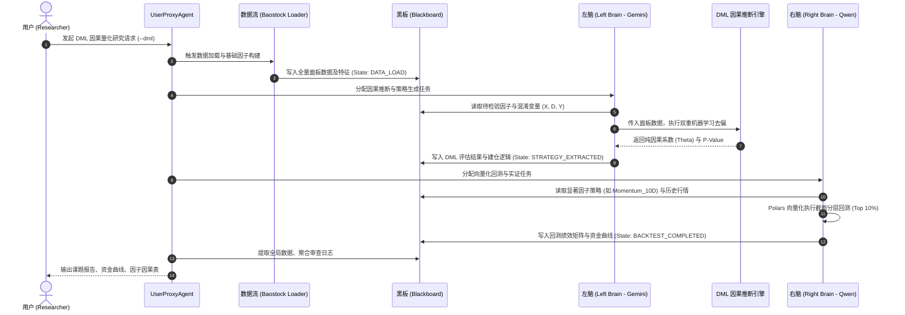

# 华南理工大学课题：DML 双脑因果量化系统架构与调用链路图

## 1. 系统架构图 (System Architecture)
本架构基于 AutoGen 框架，结合“仿生双脑”理念与 Blackboard（黑板）共享内存机制，实现了从数据清洗、DML 因果推断到向量化回测的全自动闭环。

```mermaid
graph TD
    subgraph AutoGen 仿生双脑系统 [AutoGen 仿生双脑量化架构]
        UPA[UserProxyAgent <br> 任务调度与全局协调]
        BB[/(Blackboard 黑板/状态机)<br> 全局共享内存与事件总线/]

        subgraph 左脑逻辑区 [左脑逻辑区: 发现与因果推断]
            LB[Left Brain Agent <br> (Gemini: 策略解构与生成)]
            DML[DML Causal Engine <br> (RidgeCV 双阶段去偏)]
        end

        subgraph 右脑实证区 [右脑实证区: 建构与向量计算]
            RB[Right Brain Agent <br> (Qwen: 向量化回测执行)]
            Polars[Polars / DuckDB <br> (高性能内存计算引擎)]
        end

        UPA -->|1. 任务调度| LB
        UPA -->|2. 任务调度| RB
        LB -->|读数据 / 写策略状态| BB
        RB -->|读策略数据 / 写绩效| BB
        LB -->|唤起| DML
        RB -->|唤起| Polars
    end

    User[用户 / Researcher] -->|发起课题实验指令| UPA
    Data[Baostock DataLoader <br> (数据清洗与特征工程)] -->|注入全量特征面板| BB
    BB -->|成果导出| Output[论文交付物 <br> CSV / PNG / JSON / MD]
```

## 2. 调用链路与时序说明 (Call Flow Sequence)
以下是 AutoGen 各智能体在单次 DML 课题实验中的严格执行时序与交互链路：



## 3. 核心节点详细说明

1. **UserProxyAgent (中枢调度器)**:
   - 扮演用户代理角色，接收到课题指令后，负责协调数据模块、左脑、右脑按严格顺序流转。
   - 监听 Blackboard 的状态机变化（如监听到 `STRATEGY_EXTRACTED` 后才唤醒右脑）。

2. **Blackboard (黑板模式/共享内存)**:
   - **唯一的数据真相源 (Single Source of Truth)**。所有的原始特征数据、中间因果系数、最终交易信号，全部存储于此。
   - 实现左脑与右脑的物理隔离与逻辑解耦。左脑只管推断和写入策略，右脑只管读取策略并执行算力计算。

3. **Left Brain Agent (左脑 - 因果与逻辑生成)**:
   - 从 Blackboard 获取高维面板数据，组装 DML 变量集（Y=未来收益，D=目标因子，X=混淆控制变量）。
   - 调用 `DMLCausalEngine`，采用交叉拟合（Cross-Fitting）与残差正交化提取因子的真实因果。
   - 根据因果系数的符号（正向/反转），将最优策略逻辑打包成规范配置写入 Blackboard。

4. **Right Brain Agent (右脑 - 实证与计算执行)**:
   - 扮演“交易员”和“宽客分析师”角色。从 Blackboard 提取左脑产出的策略信号。
   - 利用 `Polars` 惰性执行架构进行大规模横截面数据运算，计算组合净值、最大回撤、夏普比率等核心指标，最终将评估结果落盘为课题可用资产。
